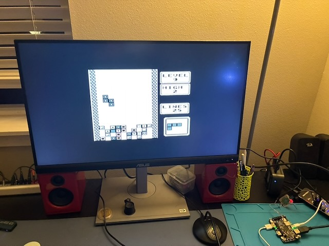

# CircuitPython Game Boy

Game Boy games on an Adafruit Fruit Jam, running under stock CircuitPython. The emulator is
[Peanut-GB](https://github.com/deltabeard/Peanut-GB) compiled into a native `.mpy` module.

[](https://drive.google.com/file/d/1w-VlF01sEsT-v7yM1ILbQxBcQJTGNDI0/view?usp=sharing)

*Click the photo for the video.*

## What you need

| part | notes |
|---|---|
| Adafruit Fruit Jam | RP2350 |
| CircuitPython 11.0.0-alpha | the `.mpy` is built for this version |
| HDMI monitor | game shows at 2x |
| headphones or speaker | optional |
| USB gamepad | optional, the 3 onboard buttons work too |
| a `.gb` ROM | not included |

## Setup

Back up your `CIRCUITPY` drive first. `code.py` will be replaced.

```sh
git clone https://github.com/mikeysklar/circuitpython-gameboy
cp -r circuitpython-gameboy/CIRCUITPY/* /Volumes/CIRCUITPY/
cp MyGame.gb /Volumes/CIRCUITPY/
```

Optional, for sound and gamepad:

```sh
circup install adafruit_fruitjam relic_usb_host_gamepad
```

The board resets and the game boots.

- The first `.gb` file found on the SD card (`/sd`), then on `CIRCUITPY`, is loaded.
- Saves go to `MyGame.sav` next to the ROM.
- Serial console prints fps every 5 seconds.

## Controls

| Fruit Jam | Game Boy |
|---|---|
| Button 1 | Left |
| Button 2 | Right |
| Button 3 | A |
| Button 1 + 2 | Start |
| Button 1 + 3 | Down |
| USB gamepad | D-pad, A, B, Start, Select |

## Speed

```
Peanut-GB on CircuitPython, Fruit Jam @ 150 MHz
+--------------------------+--------+--------+
| test                     | fps    | speed  |
+--------------------------+--------+--------+
| emulation only           | 62.6   | 105%   |
| + draw 320x240 RGB565    | 58.3   | 98%    |
| + draw 320x240 RGB332    | 50.0   | 84%    |
| 3x software scale        | 23.4   | 39%    |
| live game, no sound      | 46-48  | 77-80% |
| live game, sound+gamepad | 43-45  | 72-75% |
+--------------------------+--------+--------+
CPU loop: viper 1.17 vs GCC natmod 5.68 M instr/s (4.9x)
```

## Build the `.mpy` yourself

Needs [Arm GNU Toolchain](https://developer.arm.com/downloads/-/arm-gnu-toolchain-downloads)
(tested 15.2) and `pyelftools`. Linux x86_64 example:

```sh
curl -LO https://developer.arm.com/-/media/Files/downloads/gnu/15.2.rel1/binrel/arm-gnu-toolchain-15.2.rel1-x86_64-arm-none-eabi.tar.xz
tar xf arm-gnu-toolchain-15.2.rel1-x86_64-arm-none-eabi.tar.xz
export PATH=$PWD/arm-gnu-toolchain-15.2.rel1-x86_64-arm-none-eabi/bin:$PATH
pip install pyelftools    # Debian/Ubuntu: sudo apt install python3-pyelftools

git clone --depth 1 https://github.com/adafruit/circuitpython
cd circuitpython-gameboy/src
make MPY_DIR=../../circuitpython ARCH=armv7emsp OPT="-O2 -funroll-loops"
cp peanutgb.mpy ../CIRCUITPY/lib/
```

## How it works

- `src/peanutgb.c` wraps Peanut-GB and minigb_apu (sound) as a CircuitPython native module.
- The emulator draws each line straight into a `picodvi.Framebuffer`. No displayio refresh.
- Sound goes into a looping `audiocore.RawSample` on the Fruit Jam's TLV320 DAC.
- All buffers are Python-owned. The native code allocates nothing.

## Known issues

- Live play runs ~45 fps vs 58 fps in the bench. Cause not found yet.
- Game Boy Color (`.gbc`) is not supported yet.

## License

MIT. Peanut-GB (Mahyar Koshkouei) and minigb_apu (Alex Baines, Mahyar Koshkouei) are MIT, see
`src/peanut_gb.h` and `src/LICENSE.minigb_apu`. No ROMs are included.
